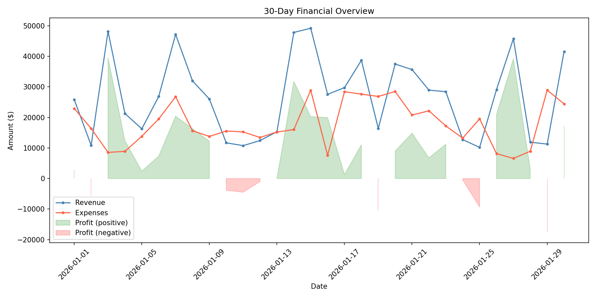

# Financial Data Analysis Pipeline

## Project Overview

This is an automated Python pipeline for financial data analysis. It leverages **Pandas** for data ingestion and manipulation, and **Matplotlib** for generating visual trend reports — enabling fast, reproducible insights from raw financial datasets.

## Key Features

- **Automated data processing** — ingests raw CSV financial data and computes revenue, expenses, and profit metrics without manual intervention
- **Version-controlled analysis** — all scripts and outputs are tracked in Git for full auditability and reproducibility
- **Visual trend reporting** — generates clear, annotated charts that surface profitable periods and loss days at a glance

## Financial Trend Chart



## How to Run

Run the full analysis pipeline with a single command:

```bash
python analyze.py
```
